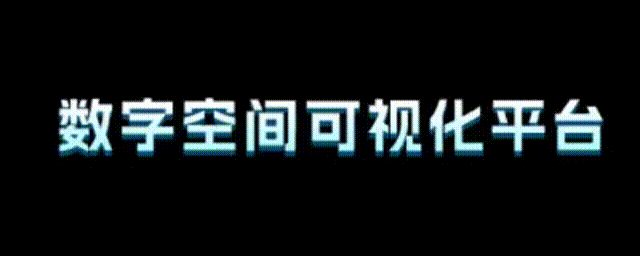
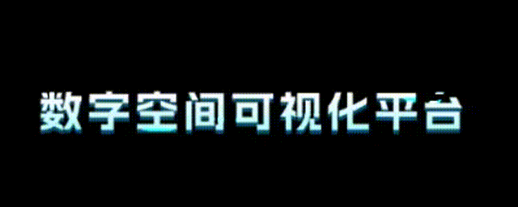
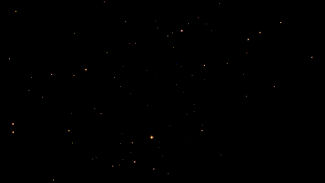
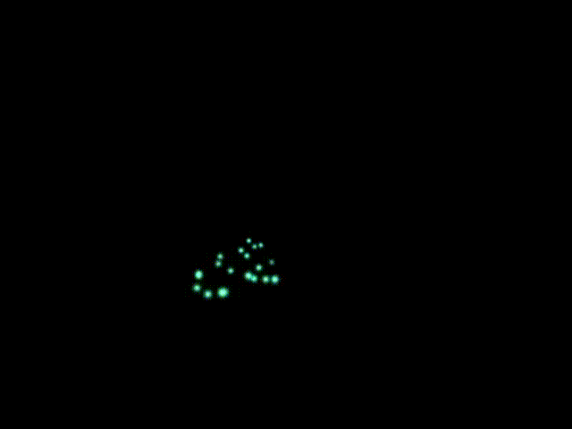
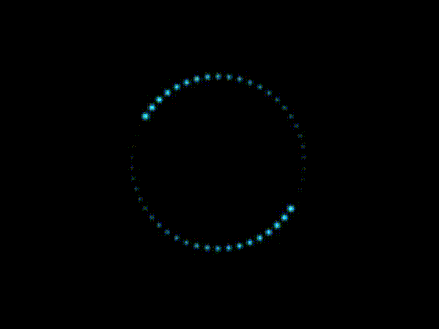
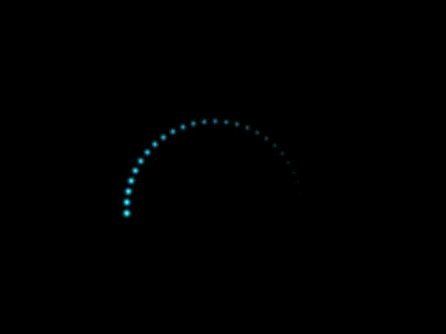
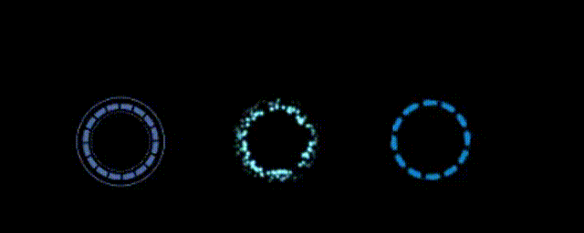

# 粒子效果

维护者：周肖

邮箱：1838079286@qq.com

粒子效果的实现：使用Shader和unity的粒子系统(Particle System)

## 效果展示

### shader效果类

流光效果

消融效果

###  粒子效果类（Particle System）

全屏粒子发散效果

小范围发散粒子效果

绕圆形的粒子效果

圆形拖尾粒子效果

三种光晕粒子效果

